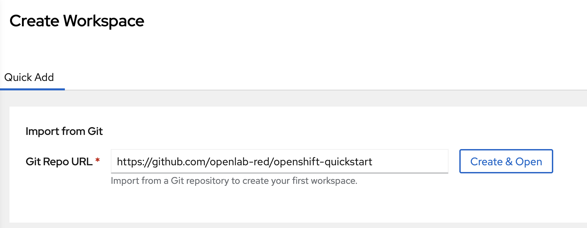
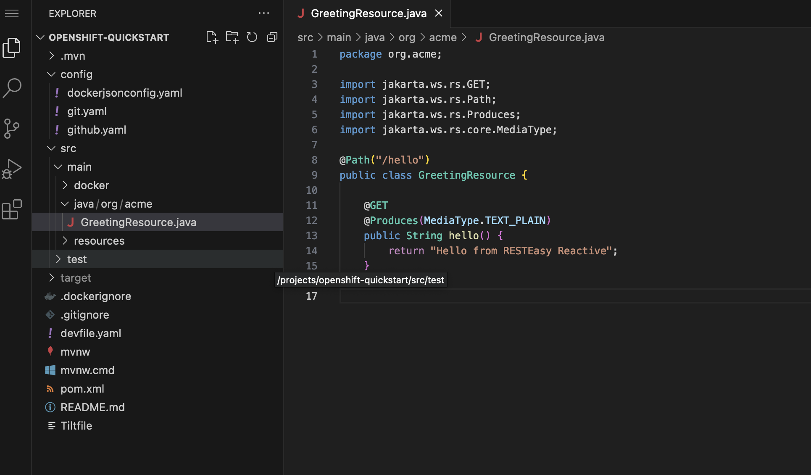
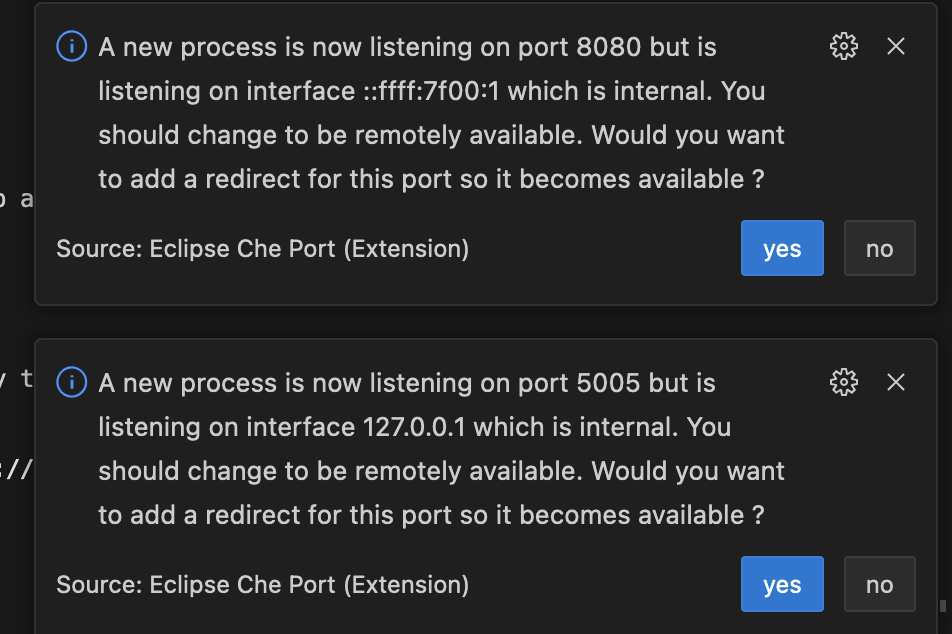

# Java

## Java on your laptop

### Build the Java Application and Launch quarkus:dev Mode
1. In Visual Studio Code, open the integrated terminal.
2. Navigate to the root directory of your Java application project.
3. Build the application (assuming you have the necessary build tools):
   ```
   ./mvnw clean package
   ```
4. Start the application in Quarkus development mode:
   ```
   ./mvnw quarkus:dev
   ```

### Check if the App is Running on localhost:8080
1. Open a web browser.
2. Navigate to `http://localhost:8080` in the address bar.
3. Verify that your Java application is running successfully.

### Deploy with the Quarkus Kubernetes Plugin to OpenShift Platform
1. To trigger building and deploying a container image you need to enable the `quarkus.kubernetes.deploy` flag (the flag is disabled by default - furthermore it has no effect during test runs or dev mode). This can be easily done with the command line:
    ```
    ./mvnw clean package -Dquarkus.kubernetes.deploy=true
    ```
### Deploy with Tilt to OpenShift Platform
1. Ensure you have Tilt installed and properly configured.
2. Create a Tiltfile (usually named `Tiltfile`) in your project directory to define your deployment configuration.
3. Inside the Tiltfile, specify the configuration for deploying your application to OpenShift using Tilt.

4. In your terminal, navigate to the project directory.

    Run Tilt to start the deployment:
    ```
    export WORKSPACE_NAMESPACE=admin-devspaces && tilt up
    ```

    Tilt will automatically deploy your application to OpenShift based on your configuration.

    Monitor the deployment progress and logs in the Tilt UI or terminal.

5. Access Your Deployed Application. Once the deployment is successful, access your deployed application through the provided route.

6. Kill `tilt up`

### Remote development with JKube

1.  In the first terminal, run `./mvnw oc:remote-dev` to start the remote dev proxy service. Once that starts, move to the second terminal and run

    ```
    ./mvnw oc:remote-dev
    ```

2. Once that starts, move to the second terminal and run

    ```
    ./mvnw quarkus:dev
    ```

3. Access Your Local Application through the provided route and start your remote development.

## Using OpenShift DevSpaces with a Devfile

### Devfile Explanation

A Devfile is a configuration file that defines the development environment for a project, including the necessary tools, dependencies, and development settings. 
It allows developers to set up consistent development environments quickly and share them with others. 
In the context of OpenShift DevSpaces, Devfiles are used to define the development environment for a project.

1. Create your workspace

    


2. Once the workspace starts you can already work, no need to worry about tools and configuration.

    


3. Inside the config directory, there are example user configurations to customize your workspaces:

    ```
        github.yaml   -> github credentials
        git.yaml      -> git config
        dockerjsonconfig.yaml   -> container engine login
    ```

    >
    > Once you applied the workspaces is restarted automatically.
    >

4. Build the application (assuming you have the necessary build tools):
   ```
   ./mvnw clean package
   ```
5. Start the application in Quarkus development mode:
   ```
   ./mvnw quarkus:dev
   ```
    >
    > OpenShift DevSpaces detects the port and exposes it on the route.
    >

    

### Deploy with Tilt

1. In your terminal

    Run Tilt to start the deployment:
    ```
    tilt up
    ```
 Tilt will automatically deploy your application to OpenShift based on your configuration.

    Monitor the deployment progress and logs in the Tilt UI or terminal.

3. Access Your Deployed Application. Once the deployment is successful, access your deployed application through the provided route.

4. Kill `tilt up`

### Remote development with JKube

1.  In the first terminal, run `./mvnw oc:remote-dev`` to start the remote dev proxy service. Once that starts, move to the second terminal and run

    ```
    ./mvnw oc:remote-dev
    ```

2. Once that starts, move to the second terminal and run

    ```
    ./mvnw quarkus:dev
    ```
