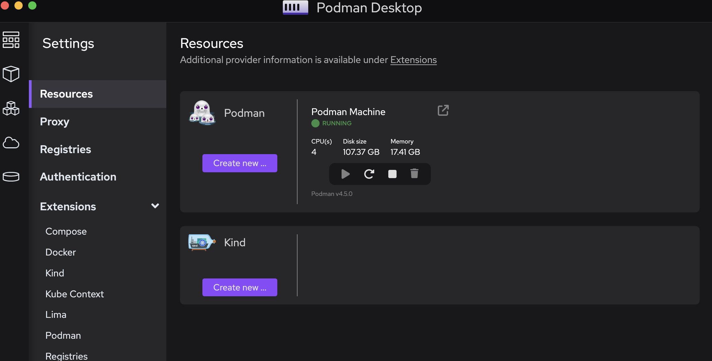

# OpenShift Quickstart

## Laptop

### Prerequisite: Install Podman Desktop

Before proceeding, make sure you have Podman Desktop installed on your laptop. 
You can download and install it from the official website: (https://podman-desktop.io/)[Podman Desktop].



### Git Clone

1. Open your terminal.
2. Navigate to the directory where you want to clone the project.
3. Run the following command to clone the Git repository:
   ```
   git clone https://github.com/openlab-red/openshift-quickstart.git
   ```
   Replace `https://github.com/openlab-red/openshift-quickstart.git` with the actual URL of the Git repository you want to clone.

### Open the Project with Visual Studio Code
1. Navigate to the project directory:
   ```
   cd openshift-quickstart
   ```
   Replace `openshift-quickstart` with the name of the directory where you cloned the Git repository.
2. Open Visual Studio Code:
   ```
   code .
   ```

## Java

   [README.md](./java/README.md)

## NodeJs

   [README.md](./nodejs/README.md)

## GoLang

   [README.md](./GoLang/README.md)
