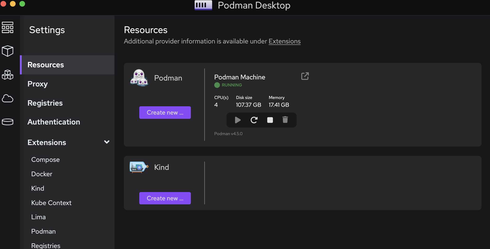
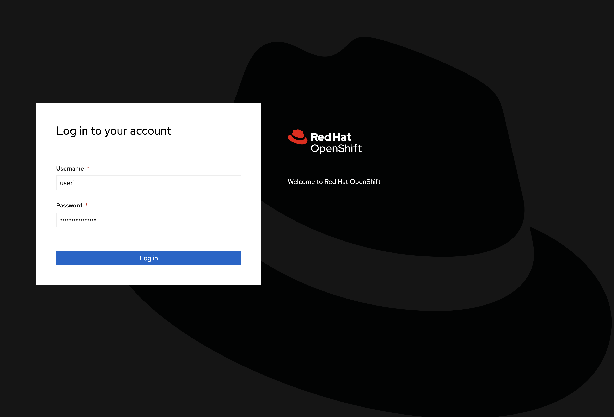
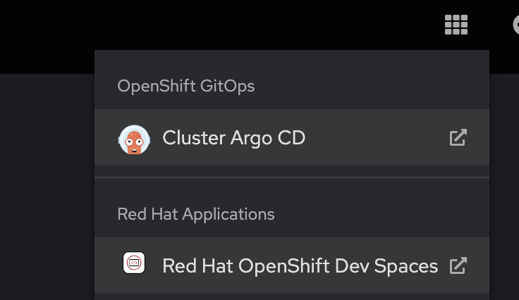
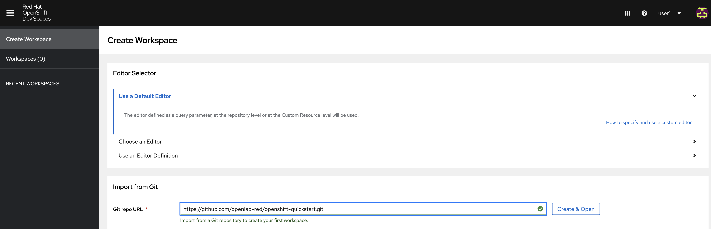
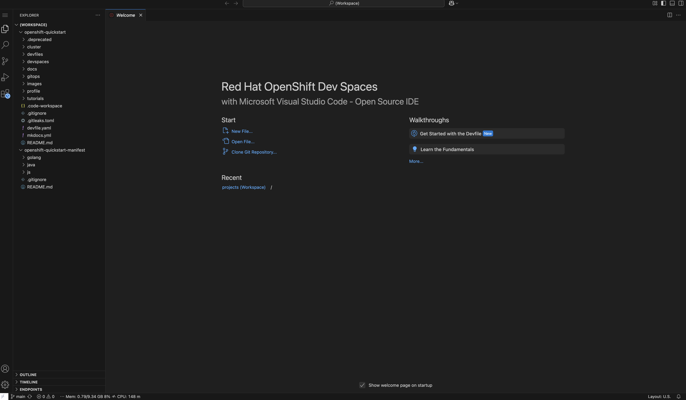

# OpenShift Quickstart

Welcome to the OpenShift Quickstart workshop! 
This workshop is designed to provide you with a seamless development experience, whether you choose to work locally on your laptop or leverage the OpenShift DevSpaces Cloud IDE. 
Both environments are equipped to help you efficiently set up and manage your development projects with ease. Follow the instructions below to get started with your preferred setup.

---

## Laptop

### Prerequisite: Install Podman Desktop

Before proceeding, make sure you have Podman Desktop installed on your laptop. 
You can download and install it from the official website: (https://podman-desktop.io/)[Podman Desktop].



### Creating a Podman Machine

To run containers locally using Podman, you need to set up a Podman machine. This is a virtual machine that runs a Podman service, allowing you to manage containers as you would on a remote server.

#### Steps to Create a Podman Machine

1. **Open your terminal**: Ensure you have access to a terminal on your local machine.

2. **Create a Podman machine**: Use the following command to create a new Podman machine. This will set up a virtual environment for running containers.
   ```bash
   podman machine init
   ```

3. **Start the Podman machine**: Once the machine is initialized, start it using the command below. This will boot up the virtual machine and prepare it for container operations.
   ```bash
   podman machine start
   ```

4. **Verify the machine status**: Check the status of your Podman machine to ensure it is running correctly.
   ```bash
   podman machine list
   ```

5. **Connect to the Podman machine**: You can now use Podman commands to manage containers on your machine. For example, to check the version of Podman running, use:
   ```bash
   podman version
   ```

### Git Clone

1. Open your terminal.
2. Choose your root workspace project:
      - Decide on the directory where you want your root workspace to reside. This will be the main directory for your project files and configurations.
3. Navigate to the directory where you want to clone the project (e.g. `/projects`).
4. Run the following command to clone the Git repository:
   ```bash
   cd /projects/
   git clone https://github.com/openlab-red/openshift-quickstart.git
   git clone https://github.com/openlab-red/openshift-quickstart-manifest.git
   ```

5. Open Visual Studio Code or your favourite IDEs:
   ```bash
   code .
   ```

1. Log into your OpenShift cluster at [OpenShift Console](https://console-openshift-console.{{ config.extra.base_url }}/).
   

2. Navigate to the DevSpaces dashboard.
   

   > Note: Even if working locally, having a DevSpaces namespace allows to have all necessary configuratin in place for the tutorial


## Necessary Tools and How to Get Them

To effectively work with OpenShift and the associated projects, ensure you have the following tools installed on your local machine:

### OpenShift Client (oc)
The OpenShift CLI (`oc`) is a command-line tool that helps you manage OpenShift applications and the OpenShift container platform itself.

- **Installation**: You can download the `oc` client directly from the [OpenShift Console](https://console-openshift-console.{{ config.extra.base_url }}/). Navigate to the question mark icon and select "Command Line Tools" to find the appropriate version for your operating system.

### Helm Client
Helm is a package manager for Kubernetes that allows you to define, install, and upgrade even the most complex Kubernetes applications.

- **Installation**: Similar to the `oc` client, Helm can also be downloaded from the [OpenShift Console](https://console-openshift-console.{{ config.extra.base_url }}/). Go to the question mark icon and choose "Command Line Tools" to access the Helm download options.

### Kustomize
Kustomize is a tool for customizing Kubernetes configurations.

- **Installation**: You can install Kustomize by following the instructions on the [Kustomize Installation](https://kubectl.docs.kubernetes.io/installation/kustomize/) page.

### Language-Specific Tools

#### Node.js
Node.js is a JavaScript runtime built on Chrome's V8 JavaScript engine, essential for running JavaScript applications.

- **Installation**: Download and install Node.js from the [official Node.js website](https://nodejs.org/).

#### Java
Java is a high-level, class-based, object-oriented programming language that is widely used for building enterprise-scale applications.

- **Installation**: You can download the latest version of OpenJDK from the [OpenJDK Downloads](https://jdk.java.net/24/) page.

#### Golang
Golang, or Go, is an open-source programming language that makes it easy to build simple, reliable, and efficient software.
- **Installation**: Visit the [Go Downloads](https://golang.org/dl/) page to download and install Go on your machine.

---

## DevSpaces

### Using DevSpaces with Devfile

OpenShift DevSpaces provides a cloud-based development environment using the configuration specified in the `devfile.yaml`. 

Follow these steps to get started:

1. Log into your OpenShift cluster at [OpenShift Console](https://console-openshift-console.{{ config.extra.base_url }}/).
   

2. Navigate to the DevSpaces dashboard.
   

3. Create a new workspace by importing this repository URL:
   ```bash
   https://github.com/openlab-red/openshift-quickstart.git
   ```
   
   DevSpaces will automatically detect and use the `devfile.yaml` at the root of the project.

4. The devfile configures:
      - A developer container with ZSH shell
      - Default workspace pointing to the project's VS Code workspace
      - Required environment variables and configurations

5. Once the workspace starts:
      - You'll have a fully configured development environment
      - All necessary tools and dependencies will be pre-installed
   

> Note: The devfile inherits configurations from a parent devfile that contains base developer tooling and settings.
