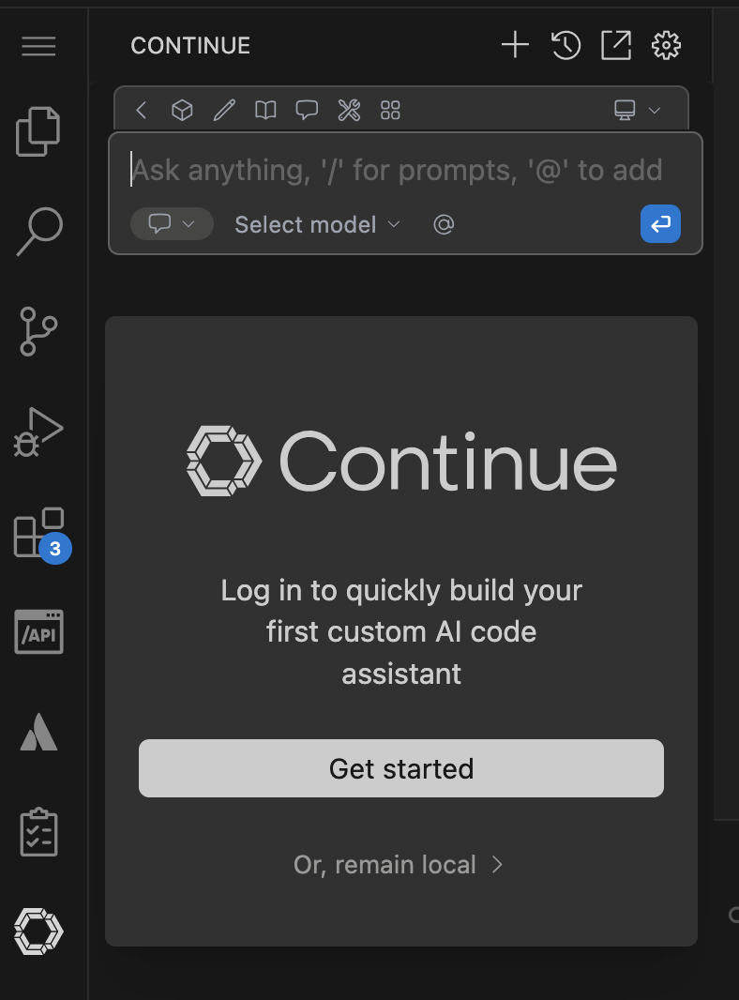
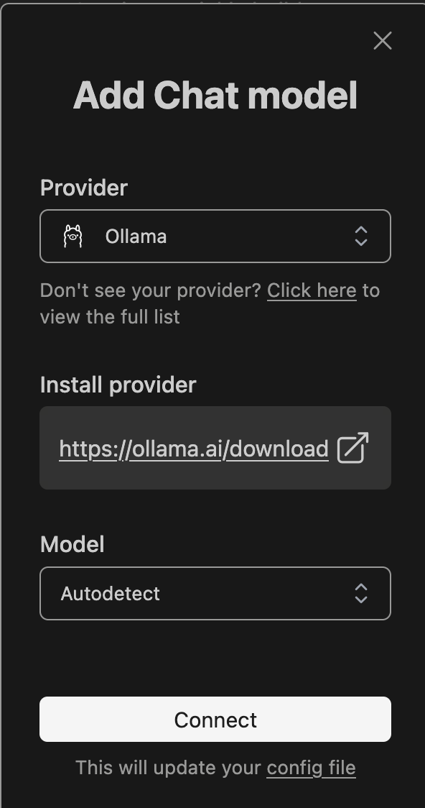
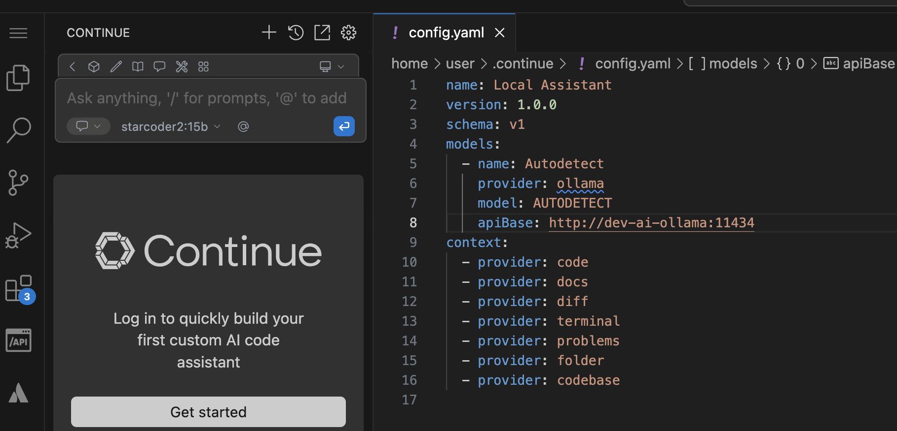
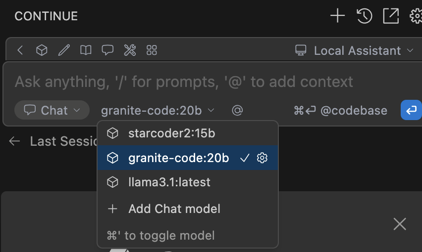

# OpenWebUI and Ollama

This tutorial guides you through deploying and running OpenWebUI and Ollama on OpenShift with Helm. You'll learn how to pull AI models and interact with them through OpenWebUI.

## Tutorial

> The code examples and instructions in this tutorial are located under the `openshift-quickstart` project in the `tutorials/ai` directory.  
> Ensure you are in this directory before executing the commands.

1. Navigate to the Tutorial Directory
    ```bash
    # Change to the tutorials/ai directory
    cd openshift-quickstart/tutorials/ai
    ```

2. Or open a New Terminal

---

## 🚀 Features

### AI Backend (Ollama)
- Easy deployment of AI models.
- Supports various open-source models.
- GPU acceleration for improved inference performance.

### AI Frontend (OpenWebUI)
- User-friendly web interface for interacting with AI models.
- Supports chat-based interactions and model management.
- Seamless integration with Ollama backend.

---

## 🛠️ Initial Setup

### Prerequisite: Local Environment Setup (Optional)

To test locally before deploying to OpenShift, follow these steps:

1. **Run Ollama Container:**

   Start Ollama locally:

   ```bash
   podman run -d -p 11434:11434 ollama/ollama
   ```

2. **Run OpenWebUI Container:**

   Start OpenWebUI locally:

   ```bash
   podman run -d -p 8080:8080 -e OLLAMA_BASE_URL=http://localhost:11434 ghcr.io/open-webui/open-webui:main
   ```

3. **Verify Containers are Running:**

   ```bash
   podman ps
   ```

---

## 🌐 AI Model Management

### Pulling AI Models with Ollama

Pull your desired AI model (e.g., llama3):

```bash
# Enter the Ollama container
podman exec -it $(podman ps -q -f ancestor=ollama/ollama) /bin/bash -c '
# Pull the models
ollama pull starcoder2:15b
ollama pull granite-code:20b
ollama pull llama2:latest

ollama list'
```

---

## ✅ Testing the Application Locally

1. **Access OpenWebUI:**

   Open your browser and navigate to:

   ```
   http://localhost:8080
   ```

2. **Configure Model in OpenWebUI:**
   - Navigate to settings and ensure Ollama API URL is set to `http://localhost:11434`.
   - Select your pulled model (e.g., llama3) from the available models.

3. **Interact with the Model:**
   - Use the chat interface to test model responses.

---

## 🚀 Deploying AI Application on OpenShift using Helm

### Steps to Deploy

1. **Navigate to the AI Helm Chart Directory:**

   Change to the directory containing the Helm chart for the AI application:

   ```bash
   cd openshift-quickstart/tutorials/ai/helm
   ```

2. **Deploy the AI Application using Helm:**

   Build dependencies and deploy:

   ```bash
   
   helm install stack .
   ```

4. **Verify Deployment:**

   Check the status of deployed pods:

   ```bash
   oc get pods -lapp.kubernetes.io/instance=stack
   ```
   You should see both OpenWebUI and Ollama pods running.

5. **Access the OpenWebUI Service:**

   Retrieve the route created by OpenShift:

   ```bash
   oc get routes stack-ai-openwebui
   ```

   Use the provided URL to interact with your AI application.

3. **Pull AI Model in Ollama Pod:**

   Access the Ollama pod and pull your desired model:

   ```bash
   # Get the Ollama pod name
   OLLAMA_POD=$(oc get pod -l app.kubernetes.io/instance=stack,app.kubernetes.io/component=ollama -o jsonpath='{..metadata.name}')
   
   # Access the pod and pull the model
   oc rsh $OLLAMA_POD
   
   ollama pull starcoder2:15b
   ollama pull granite-code:20b
   ollama pull llama2:latest
   ```

   Wait for the model download to complete. This may take several minutes depending on your connection speed and the model size.

---

## 🔌 Configure Continue VSCode Extension with Ollama

To enhance your development experience, you can integrate Ollama with the Continue VSCode extension:

1. **Install Continue Extension:**
   - Open VSCode Extensions (Ctrl+Shift+X)
   - Search for "Continue"
   - Install the extension by "Continue Dev"

   


2. **Configure the model**

   

2. **Configure Continue Settings:**
   - Open VSCode Settings (Ctrl+,)
   - Search for "Continue"
   - Set the following configurations:
     ```yaml
        name: Local Assistant
        version: 1.0.0
        schema: v1
        models:
        - name: Autodetect
            provider: ollama
            model: AUTODETECT
            apiBase: http://stack-ai-ollama:11434
        context:
        - provider: code
        - provider: docs
        - provider: diff
        - provider: terminal
        - provider: problems
        - provider: folder
        - provider: codebase
     ```
   

3. **Use Continue with Ollama:**

    

---


## 📌 Additional Resources

- [OpenWebUI Documentation](https://github.com/open-webui/open-webui)
- [Ollama Documentation](https://github.com/ollama/ollama)
