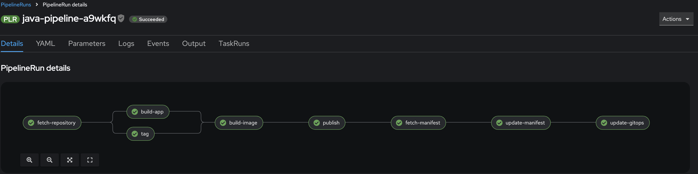
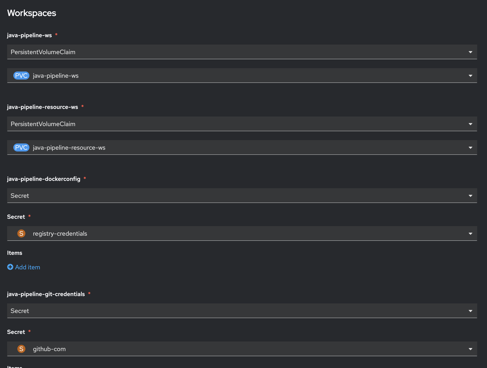

# Pipeline Setup

This tutorial will guide you through the process of setting up and executing a pipeline using the provided Helm chart. We will cover creating a pipeline and PVC, launching a PipelineRun, and setting up event listeners and triggers.

> The code examples and instructions in this tutorial are located under `openshift-quickstart` project in the
> `tutorials/gitops/pipeline` directory. 
> Ensure you are in this directory before executing the commands.
>

1. Navigate to the Tutorial Directory
    ```bash
    cd openshift-quickstart/tutorials/gitops/pipeline
    ```

2. Or open a New Terminal

---

## Prerequisites

Before installing the pipeline, you need to set up registry credentials to allow pushing images to your container registry.

1. Link the secret to the pipeline service account:

    ```bash
    oc secrets link pipeline registry-credentials --for=pull,mount
    ```

This configuration allows the pipeline to authenticate with your container registry when pushing built images.

---

## Install the Pipeline Using Helm

The provided Helm chart is designed to be generic and reusable, allowing multiple users and pipeline types to utilize the same chart with minimal configuration. This is achieved through parameterization and naming conventions.

**Conventions Explained:**

- **Release Name:**  
  The Helm release name should reflect the pipeline type you are deploying. Common examples include:
  - `java`
  - `golang`
  - `nodejs`

  This naming convention helps distinguish between different pipeline instances clearly and consistently.

- **Namespace:**  
  The namespace parameter allows multiple users to deploy their pipelines independently without conflicts. Typically, each user has a dedicated namespace, such as:
  - `devspaces-user1`

  Using separate namespaces ensures isolation and prevents resource conflicts between different users or teams.

- **Generic Chart Structure:**  
  The Helm chart uses templating to dynamically generate Kubernetes resources based on the provided parameters. This approach allows the same chart to be reused across different pipeline types and namespaces without modification.

**Example Installation Command:**

Replace `<pipeline-type>` with your chosen pipeline type (`java`, `golang`, or `nodejs`) and `<namespace>` with your user-specific namespace (`user1` or `devspaces-user1`):

```bash

helm install <pipeline-type> helm/pipeline --namespace <namespace>
```

**Detailed Example:**

For instance, if you are deploying a Java pipeline for user `user1`, your command would look like this:

```bash
cd  helm/
helm install java . -f java/values.yaml --namespace devspaces-user1
```

## Understanding Pipeline Resources

When you install the pipeline Helm chart, it creates several Kubernetes resources that work together to form a complete CI/CD pipeline. Let's understand each component and its role.



### Core Pipeline Definition

The main pipeline is created with a series of connected tasks that handle your application's build and deployment process:

```yaml
# Example pipeline structure
Pipeline
├── fetch-repository     # Clones source code
├── tag                 # Generates build tag
├── build-app          # Language-specific build
├── build-image        # Creates container image
├── publish            # Publishes to registry
├── fetch-manifest     # Gets GitOps manifests
├── update-manifest    # Updates image details
└── update-gitops     # Updates GitOps config
```

### Language-Specific Builds

The pipeline automatically includes the appropriate build task based on your chosen pipeline type:
- For Java: Maven/Gradle build process
- For Golang: Go build process
- For JavaScript: npm/yarn build process

### Persistent Storage

The pipeline creates two Persistent Volume Claims (PVCs) to maintain data between pipeline runs:

1. **Workspace PVC** (`<pipeline-name>-ws`):
    - Size: 10Gi
    - Purpose: Stores source code and build artifacts
    - Access Mode: ReadWriteOnce

2. **Resource Workspace PVC** (`<pipeline-name>-resource-ws`):
    - Size: 10Gi
    - Purpose: Stores GitOps manifests and configurations
    - Access Mode: ReadWriteOnce

### Trigger System

The pipeline includes an event-driven system to automatically start builds:

1. **Event Listener**:
    - Acts as a webhook endpoint
    - Receives and validates incoming events
    - Routes events to appropriate triggers

2. **Trigger Template**:
    - Defines how to create PipelineRuns
    - Maps incoming event data to pipeline parameters
    - Ensures consistent pipeline execution

### Usage Example

To install the pipeline with these resources:

```bash
# For a Java application
helm install java . -f java/values.yaml --namespace devspaces-user1

# For a Golang application
helm install golang . golang/values.yaml --namespace devspaces-user1

# For a JavaScript application
helm install js-frontend . js/values.yaml --namespace devspaces-user1
helm install js-backend . js/values-backend.yaml --namespace devspaces-user1
```

## Resource Naming

All resources follow a consistent naming pattern based on your installation parameters:
- Resources are prefixed with the pipeline type (java/golang/js)
- Resources are created in the specified namespace
- Each resource includes appropriate labels for management and organization

## Pipeline Flow

1. When triggered, the pipeline first clones your source code
2. Generates a unique tag for the build
3. Builds your application using language-specific tools
4. Creates and publishes a container image
5. Updates GitOps manifests with new image details
6. Commits changes to your GitOps repository

---

## Launch the PipelineRun

To execute the pipeline, we need to create a PipelineRun using the OpenShift UI.

1. **Create the PipelineRun:**

   - Navigate to the OpenShift Console and log in with your credentials.
   - Go to the "Pipelines" section in your project.
   - Click on the target pipeline from the list.
   - Click Actions and "Start" button.
 
2. **Select Workspaces:**

   Before starting the PipelineRun, ensure that you have selected the appropriate workspaces and PVCs. This is crucial for the pipeline to access necessary resources and credentials.

   - **Select Workspaces:**
     - Ensure the following workspaces are selected:
       - `<pipeline-type>-ws`
       - `<pipeline-type>-resource-ws`
       - `<pipeline-type>-dockerconfig`
       - `<pipeline-type>-git-credentials`

   

   - **Select PVCs:**
     - Ensure the following PVCs are selected:
       - `<pipeline-type>-ws` (replace with actual PVC name)
       - `<pipeline-type>-resource-ws` (replace with actual PVC name)

   - **Link Docker and GitHub Credentials:**
     - Ensure that the Docker and GitHub credentials are linked to the pipeline service account:
       - `registry-credentials` for Docker
       - `git-credentials` for GitHub

   After selecting the workspaces, PVCs, and linking the credentials, proceed to the next step.

3. **Click "Start":**

   Once all selections are made, click the "Start" button to initiate the PipelineRun.

4. **Verify the Manifest Update:**

   After the pipeline completes successfully, verify that the manifest repository has been updated with the new image details:

   - Check the latest commit in the repository
   - Verify that the image tag has been updated in the relevant deployment manifests
   - The commit message should indicate the pipeline run that triggered the update

   This confirms that the pipeline has successfully built and published the new image, and updated the GitOps manifests accordingly.
