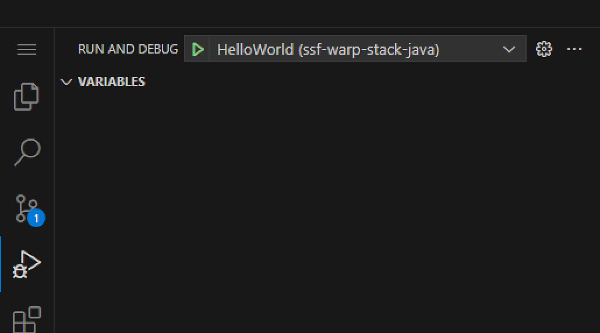

# Hello World Maven Project

This project is a foundational Java application that outputs "Hello, World!" to demonstrate the basics of using Maven for building and managing Java projects.

## Tutorial: Build, Run, and Debug with Visual Studio Code

### Step 1: Build the Project

1. Open the terminal in VSCode (`Terminal -> New Terminal`).
2. Run the following command to build the project:

  ```bash
   cd helloworld
   mvn clean install
  ```

### Step 4: Launch the Application



1. Navigate to the `Run and Debug` view by clicking on the play icon on the sidebar or pressing `Ctrl+Shift+D`.
2. Select the `HelloWorld` configuration from the dropdown.
3. Click the green play button to start the application.

### Step 5: Debug the Application

1. Set breakpoints in your code by clicking in the gutter next to the line numbers.
2. Use the `Run and Debug` view to start debugging with the `HelloWorld` configuration.
3. The application will stop at your breakpoints, allowing you to inspect variables and step through the code.

## Alternative: Using Command Line

### Step 1: Build the Project by cmd

1. Open a terminal and navigate to the `helloworld` project directory.
2. Run the following command to build the project:

   ```bash
   mvn clean package
   ```

### Step 2: Run the Application

After building, you can run the application using the `java -jar` command:

```bash
java -jar target/helloworld-1.0.0-SNAPSHOT.jar
```
