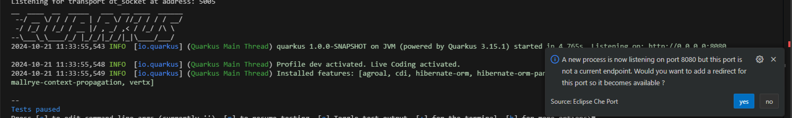
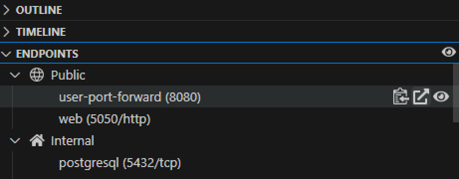
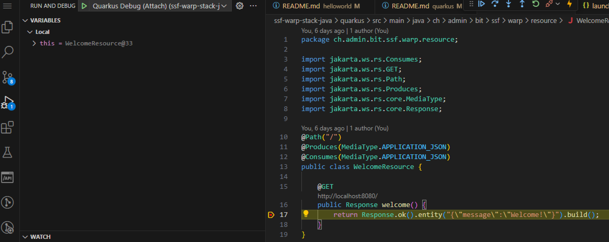

# Quarkus Hello World Application

Welcome to the Quarkus Hello World Application! This project leverages Quarkus, a high-performance Java framework designed for modern cloud-native applications. In this guide, you'll learn how to build, run, and debug a straightforward "Hello World" application using Visual Studio Code, making the most of Quarkus's capabilities.

## Building the Application

To build the application, use the following Maven command:

```bash
cd quarkus
mvn clean package
```

This command will compile the project and package it into a JAR file located in the `target/quarkus-app/` directory.

## Running the Application

You can run the application like normal java app.

```bash
java -jar target/quarkus-app/quarkus-run.jar
```

Or you can run your application in development mode, which enables live coding, using:

```bash
mvn quarkus:dev
```

Expose the endpoint and access the application.




## Debugging with VSCode

>
> It is already defined in the project.
>

1. **Configure Launch Settings**:
   Create a `launch.json` file in the `.vscode` directory with the following configuration:

   ```json
   {
     "version": "0.2.0",
     "configurations": [
       {
         "type": "java",
         "name": "Quarkus Debug (Attach)",
         "request": "attach",
         "hostName": "localhost",
         "port": 5005
       }
     ]
   }
   ```

2. **Start the Application in Debug Mode**:
   Run the application with debugging enabled:

   ```bash
   mvn quarkus:dev
   ```

3. **Attach the Debugger**

   In VSCode, go to the Run and Debug view, and select "Quarkus Debug (Attach)" to start debugging.

  

## Packaging the Application

To package the application execute:

```bash
mvn package
```

Run the packaged application using:

```bash
java -jar target/quarkus-app/quarkus-run.jar
```

## Creating a Native Executable

You can create a native executable using:

```bash
mvn package -Pnative
```

Run the native executable with:

```bash
./target/quarkus-1.0.0-SNAPSHOT-runner -Dquarkus.http.port=8081
```

## Building the Container

To build a container for your Quarkus application, follow these steps:

### Deploy external postgresql database

To deploy it, you can simply run the Task `099 - Install Postgres with OpenShift` from the Task Manager.

### Steps

1. **Ensure the Application is Packaged**:
   Before building the Docker image, make sure your application is packaged. You can do this by running:

   ```bash
   mvn package -Dquarkus.profile=prod
   ```

2. **Build the Image**:
   Use the following command to build the image. This command uses the Dockerfile located at `src/main/docker/Dockerfile.jvm`:

   ```bash
   podman build -f src/main/docker/Dockerfile.jvm -t quarkus:latest .
   ```

3. **Run the Docker Container**:
   Once the image is built, you can run the container using:

   ```bash
   podman_run quarkus:latest -p 8080:8080 
   ```

4. **Deploy with the helm chart**:

   ```bash
   podman tag quarkus:latest quay.io/mmascia/stack-java/quarkus:latest
   podman push quay.io/mmascia/stack-java/quarkus:latest
   cd ..
   helm upgrade --install quarkus helm/java-app
   ```

These steps will help you build and run your Quarkus application in a container, allowing for easy deployment and testing.


## Database

The Quarkus application supports multiple database configurations. You can run the application with different databases using the following methods:

### Prerequisites for Database Containers

Before running the application with a specific database profile, ensure that the respective database container is up and running. You can use the following commands to start the database containers:

- **PostgreSQL**: 

  Note: PostgreSQL is already running as a sidecar container in the workspace. If you need to start it manually, execute the following command:

- **MySQL**: 
  To start the MySQL container, execute the following command:

  ```bash
  podman run --name mysql -e MYSQL_USER=user -e MYSQL_PASSWORD=pass -e MYSQL_ROOT_PASSWORD=root -e MYSQL_DATABASE=db -p 3306:3306 registry.redhat.io/rhel8/mysql-80:latest
  ```

- **MongoDB**: 
  To start the MongoDB container, execute the following command:

  ```bash
  podman run --name mongodb -v /tmp/:/bitnami -e MONGODB_ROOT_USER=user -e MONGODB_ROOT_PASSWORD=pass -e MONGODB_REPLICA_SET_MODE=primary -e MONGODB_REPLICA_SET_NAME=rs0 -e MONGODB_REPLICA_SET_KEY=replicakey123456 -e MONGODB_DATABASE=db -p 27017:27017 docker.io/bitnami/mongodb:latest
  ```

Ensure that the respective database container is running before starting the application with the desired profile.

### Launching the Application

To launch the Quarkus application with a specific database profile, use the following commands:

- **PostgreSQL (Default)**:
  Run the application with the default PostgreSQL profile:

  ```bash
  mvn quarkus:dev
  ```

- **MySQL**:
  To run the application with MySQL, specify the MySQL profile:

  ```bash
  mvn quarkus:dev -Dquarkus.profile=mysql
  ```

- **MongoDB**:
  To run the application with MongoDB, specify the MongoDB profile:

  ```bash
  mvn quarkus:dev -Dquarkus.profile=mongodb
  ```

These commands will start the Quarkus application in development mode with the specified database configuration.


## Additional Resources

- [Quarkus Official Documentation](https://quarkus.io/documentation/)
- [Quarkus Guides](https://quarkus.io/guides/)

This guide should help you get started with building, running, and debugging a Quarkus application using VSCode. If you encounter any issues, refer to the Quarkus documentation or seek help from the community.
