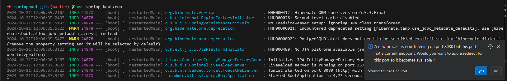

# Spring Boot Sample Application

Welcome to the Spring Boot Sample Application! This project leverages Spring Boot, a powerful Java framework for building production-ready applications. In this guide, you'll learn how to build, run, and debug a Spring Boot application using Visual Studio Code, making the most of Spring Boot's capabilities.

## Building the Application

To build the application, use the following Maven command:

```bash
cd springboot
mvn clean package
```

This command will compile the project and package it into a JAR file located in the `target/` directory.

## Running the Application

You can run the application like normal java app.

```bash
java -jar target/boot-0.0.1-SNAPSHOT.jar
```

Or you can run your application in development mode, which enables live coding, using:

```bash
mvn spring-boot:run
```

Expose the endpoint and access the application.



## Debugging with VSCode

>
> It is already defined in the project.
>

1. **Run in VSCode**:
   - Open the project in VSCode.
   - Navigate to the `BootApplication.java` file.
   - Click on the `Run` button above the `main` method or use the `Run` menu.

## Debugging the Application

1. **Debug in VSCode**:
   - Set breakpoints in your Java files.
   - Open the `Run and Debug` panel in VSCode (Ctrl+Shift+D).
   - Click on `Run and Debug` and select `Java` environment.
   - The application will start in debug mode, and execution will pause at your breakpoints.

## Building the Container

To build a container for your Quarkus application, follow these steps:

### Deploy external postgresql database

To deploy it, you can simply run the Task `099 - Install Postgres with OpenShift` from the Task Manager.

### Steps

1. **Ensure the Application is Packaged**:
   Before building the Docker image, make sure your application is packaged. You can do this by running:

   ```bash
   mvn package
   ```

2. **Build the Image**:
   Use the following command to build the image. This command uses the Dockerfile located at `src/main/docker/Dockerfile.jvm`:

   ```bash
   podman build -f src/main/docker/Dockerfile.jvm -t boot:latest .
   ```

3. **Run the Docker Container**:
   Once the image is built, you can run the container using:

   ```bash
   podman_run boot:latest -p 8080:8080 
   ```

4. **Deploy with the helm chart**:

   ```bash
   podman tag boot:latest quay.io/mmascia/stack-java/boot:latest
   podman push quay.io/mmascia/stack-java/boot:latest
   cd ..
   helm upgrade --install boot helm/java-app -f helm/java-app/values-boot.yaml
   ```

These steps will help you build and run your Spring Boot application in a container, allowing for easy deployment and testing.

// ... existing content ...

## Database

The application supports multiple database configurations through Spring profiles. You can run the application with different databases using the following methods:

### Prerequisites for Database Containers

Before running the application with a specific database profile, ensure that the respective database container is up and running. You can use the following commands to start the database containers:

- **PostgreSQL**: 

  Note: PostgreSQL is already running as a sidecar container in the workspace. If you need to start it manually, execute the following command:

- **MySQL**: 
  To start the MySQL container, execute the following command:

  ```bash
  podman run --name mysql -e MYSQL_USER=user -e MYSQL_PASSWORD=pass -e MYSQL_ROOT_PASSWORD=root -e MYSQL_DATABASE=db -p 3306:3306 registry.redhat.io/rhel8/mysql-80:latest
  ```

- **MongoDB**: 
  To start the MongoDB container, execute the following command:

  ```bash
  podman run --name mongodb -v /tmp/:/bitnami -e MONGODB_ROOT_USER=user -e MONGODB_ROOT_PASSWORD=pass -e MONGODB_REPLICA_SET_MODE=primary -e MONGODB_REPLICA_SET_NAME=rs0 -e MONGODB_REPLICA_SET_KEY=replicakey123456 -e MONGODB_DATABASE=db -p 27017:27017 docker.io/bitnami/mongodb:latest
  ```

Ensure that the respective database container is running before starting the application with the desired profile.


### PostgreSQL (Default)

The default profile uses PostgreSQL. Run the application with either:

```bash
mvn spring-boot:run
```

Or explicitly specify the PostgreSQL profile:

```bash
mvn spring-boot:run
```

### MySQL

To run the application with MySQL:

```bash
mvn spring-boot:run -Dspring-boot.run.profiles=mysql
```

### MongoDB

To run the application with MongoDB:

```bash
mvn spring-boot:run -Dspring-boot.run.profiles=mongodb
```

## Additional Resources

- [Spring Boot Documentation](https://spring.io/projects/spring-boot)
- [VSCode Java Documentation](https://code.visualstudio.com/docs/java/java-tutorial)

## Troubleshooting

- Ensure all dependencies are correctly installed.
- Check the `pom.xml` for any missing dependencies or plugins.
