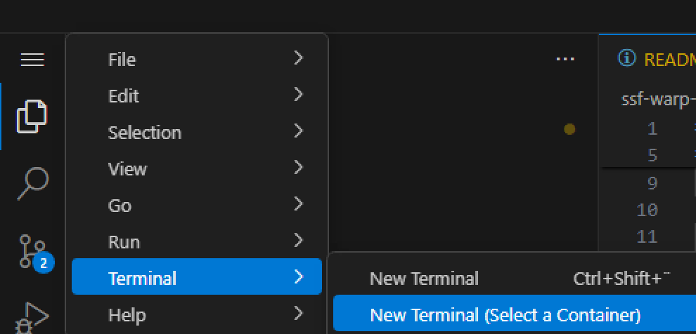
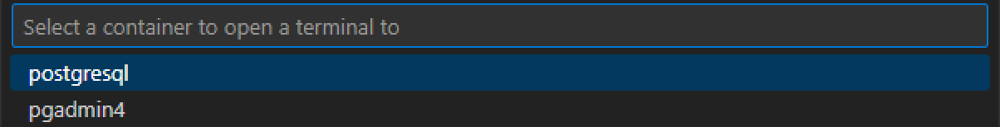
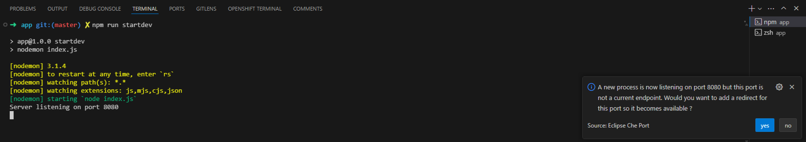
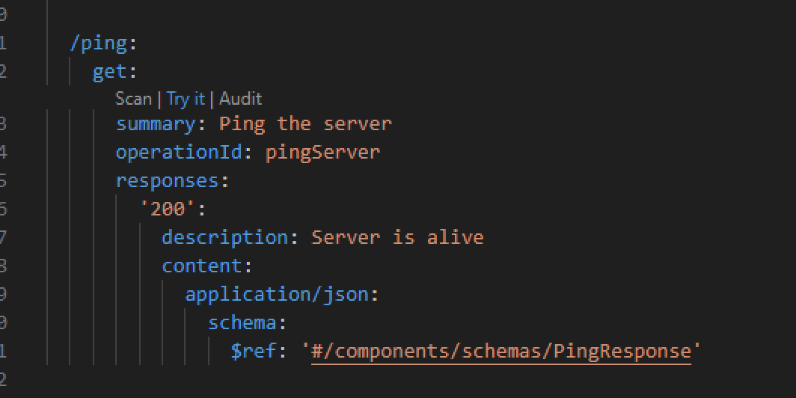
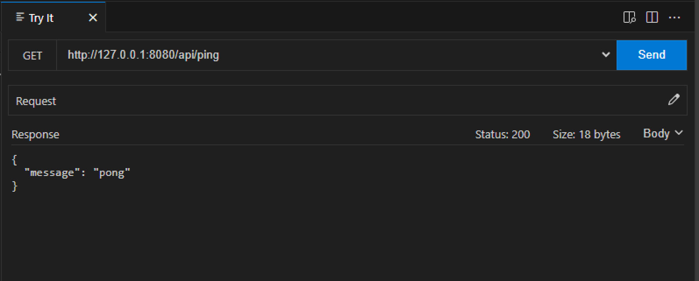
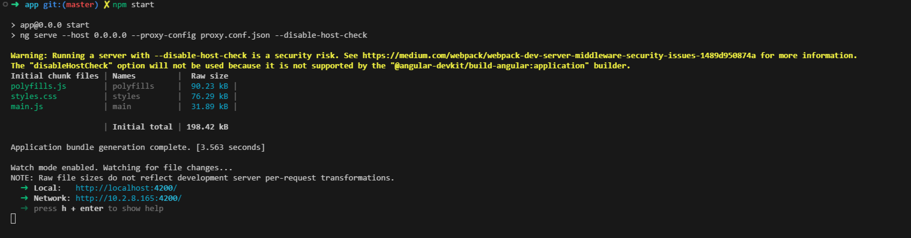
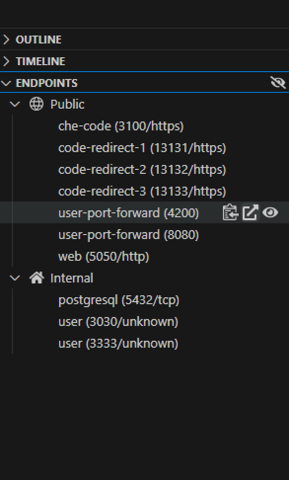

# NodeJS Express API with Angular Client (Material Design)

This tutorial guides you through building and running a simple REST API using NodeJS Express and an Angular client application with Material Design.

## Tutorial

> The code examples and instructions in this tutorial are located under `openshift-quickstart` project in the
> `tutorials/js` directory. 
> Ensure you are in this directory before executing the commands.
>

1. Navigate to the Tutorial Directory
    ```bash
    # Change to the tutorials/simple directory
    cd openshift-quickstart/tutorials/js
    ```

2. Or open a New Terminal

---

## 🚀 Features

### Backend (NodeJS Express API)
- Provides RESTful endpoints ([OpenAPI Specification](./openapi.yaml)).
- Secure database interactions using prepared statements (PostgreSQL).

### Frontend (Angular Client)
- Fetches and displays messages from the API.
- Allows adding new messages.
- Implements API health check (ping functionality).
- Uses Material Design for a visually appealing interface.

---

## 🛠️ Initial Setup

### Prerequisite: Spin Up PostgreSQL Container on Laptop

To set up a PostgreSQL container locally, follow these steps:

1. **Run PostgreSQL Container:**

   Start a new PostgreSQL container with the following command:

   ```bash
   podman run -d -v $(pwd):/projects -e POSTGRESQL_USER=user -e POSTGRESQL_PASSWORD=pass -e POSTGRESQL_ROOT_PASSWORD=root -e POSTGRESQL_DATABASE=db -p 5432:5432 registry.redhat.io/rhel9/postgresql-16:latest
   ```

4. **Verify Container is Running:**

   Check that your PostgreSQL container is running:

   ```bash
   podman ps
   ```

### Database Configuration (First-time setup)

1. **Open Terminal on PostgreSQL container:**

   
   

2. **Access PostgreSQL Container:**

   To access the running PostgreSQL container, execute the following command, replacing `<containerId>` with the actual container ID obtained from the `podman ps` command:

   ```bash
   podman exec -it <containerId> bash
   ```

   This command will open an interactive terminal session inside the PostgreSQL container, allowing you to run database commands directly.

2. **Initialize Database Schema:**

   Execute the following command in the terminal (password: `pass`):

   ```bash
   cd /projects
   psql -d db -U user -W -f tutorials/js/backend/db/schema.sql
   ```

   **Expected Output:**
   ```bash
   Password: 
   CREATE TABLE
   ```
---

## 🌐 Backend Development (NodeJS)

### Install Dependencies

Navigate to the backend directory and install dependencies:

```bash
cd backend/app
npm install
```

### Start Backend Server (Live Coding)

Run the backend server with live reload using `nodemon`:

```bash
npm run startdev
```



> **Note:** (DevSpaces only) Click "Yes" if prompted to expose the application outside the workspace.

### Explore API Endpoints

Access the [OpenAPI Specification](./openapi.yaml) directly under `backend/app` to test endpoints interactively.




---

## 🎨 Frontend Development (Angular)

### Install Dependencies

Navigate to the frontend directory and install dependencies:

```bash
cd frontend/app
npm install
```

### Start Frontend Application (Live Coding)

Launch the Angular application with live reload:

```bash
npm start
```



---

## ✅ Testing the Application

1. **Access Frontend Application:**

   From the endpoint section, click the provided link to open the frontend application.

   

2. **Verify Functionality:**
   - Check message retrieval and display.
   - Test adding new messages.
   - Use ping functionality to verify API health.

---

## 📌 Additional Resources

- [Angular Documentation](https://angular.io/docs)
- [ExpressJS Documentation](https://expressjs.com/)
- [Material Design Components](https://material.angular.io/)

---

🎉 **Congratulations!** You've successfully set up and tested your NodeJS Express API with an Angular client using Material Design.


---

## 🚀 Deploying Backend on OpenShift using Helm

### Steps to Deploy

1. **Navigate to the Backend Helm Chart Directory:**

   Change to the directory containing the Helm chart for the backend:

   ```bash
   cd openshift-quickstart-manifest/js/backend/helm
   ```

2. **Deploy the Backend using Helm:**

   Use the following command to deploy the backend application on OpenShift:

   ```bash
   # Note: This command ensures all chart dependencies, including the PostgreSQL chart in our case, are up-to-date before installation.
   helm dependency build
   
   helm install js-backend .
   ```

   This command will deploy the backend application using the Helm chart located in the current directory.

3. **Verify Deployment:**

   Check the status of the deployed pods to ensure everything is running smoothly:

   ```bash
   oc get pods -lapp.kubernetes.io/instance=js-backend
   ```

   You should see the backend and postgres pods up and running.

4. **Access the Backend Service:**

   Once deployed, you can access the backend service using the route created by OpenShift. Retrieve the route with:

   ```bash
   oc get routes js-backend
   ```

   Use the URL provided to interact with your backend API.


## 🚀 Deploying Frontend on OpenShift using Helm

### Steps to Deploy

1. **Navigate to the Frontend Helm Chart Directory:**

   Change to the directory containing the Helm chart for the frontend:

   ```bash
   cd openshift-quickstart-manifest/js/frontend/helm
   ```

  > **Note:** Before deploying the frontend, ensure that the following values in the `values.yaml` file are correctly set:
  > - `baseDomain`: This should be set to the domain of your OpenShift cluster.
  > - `backendName`: This should match the name of the backend service you deployed. By default, it is set to `js-backend`.
  > 
  > These values are crucial for the frontend to correctly interact with the backend service and be accessible via the OpenShift routes.

  ```yaml
  baseDomain: {{ config.extra.base_url }}
  backendName: js-backend
  ```

2. **Deploy the Frontend using Helm:**

   Use the following command to deploy the frontend application on OpenShift:

   ```bash
   helm install js-frontend .
   ```

   This command will deploy the frontend application using the Helm chart located in the current directory.

3. **Verify Deployment:**

   Check the status of the deployed pods to ensure everything is running smoothly:

   ```bash
   oc get pods -lapp.kubernetes.io/instance=js-frontend
   ```

   You should see the frontend pod up and running.

4. **Access the Frontend Service:**

   Once deployed, you can access the frontend service using the route created by OpenShift. Retrieve the route with:

   ```bash
   oc get routes js-frontend
   ```

   Use the URL provided to interact with your frontend application.

5. **Test Interaction with Backend:**

   Open the frontend application in your browser using the URL obtained in the previous step. Verify that the frontend can successfully interact with the backend API by performing actions that require backend communication, such as fetching or adding messages.

   If the frontend is unable to communicate with the backend, ensure that the backend service URL is correctly configured in the frontend application settings.
