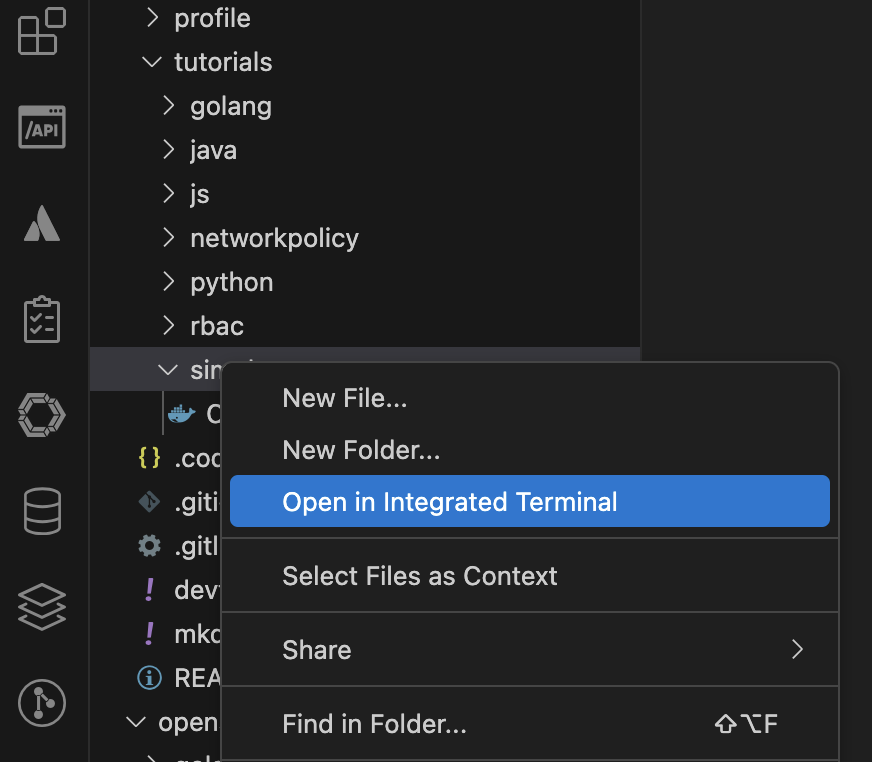
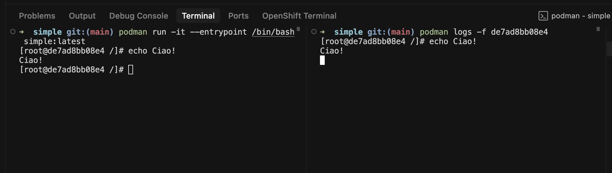

# Simple Container

## Tutorial 

This guide walks through basic container operations using Podman.

> The code examples and instructions in this tutorial are located under `openshift-quickstart` project in the
> `tutorials/simple` directory. 
>
> Ensure you are in this directory before executing the commands.
>

---

1. Navigate to the Tutorial Directory
    ```bash
    cd openshift-quickstart/tutorials/simple
    ```

2. Or open a New Terminal
  

3. Build an image tagged as 'simple:latest' from the Dockerfile in current directory
    ```bash
    podman build -t simple:latest .
    ```

2. Run the container in detached mode
    ```bash
    podman run -d simple:latest
    ```

3. List all running containers
    ```bash
    podman ps -a
    ```

4. Start a new container with an interactive bash shell
    ```bash
    podman run -it --entrypoint /bin/bash simple:latest
    ```

5. View Container Logs, split the terminal
    ```bash
    # First get the container ID
    podman ps
    
    # Stream the logs from the container (-f follows the log output)
    podman logs -f <containerID>
    ```
    
    
    >
    > Replace `<containerID>` with the actual container ID 
    > 
    > from `podman ps` output or `$(podman ps -q)`.
    >

---

## Exercies

### Exercise 1: Modify and Rebuild the Container Image

**Objective:** Learn how to modify a `Containerfile` and rebuild the container image.

1. **Edit the `Containerfile`:**
    
    Open the `Containerfile` in a text editor.

    Add a new environment variable to the image. For example, add the line:
    ```dockerfile
    ENV MY_VAR="Hello, Podman!"
    ```

2. **Rebuild the Container Image:**
   
    Use the following command to rebuild the image with the new changes:
    ```bash
    podman build -t simple:latest .
    ```

3. **Verify the Changes:**
    
    Run a new container and check if the environment variable is set:
    ```bash
    podman run --rm --entrypoint printenv simple:latest MY_VAR
    ```
    > The `--entrypoint` flag overrides the default `echo` command defined in the Containerfile, 
    > 
    > allowing us to run the `printenv` command instead to verify our environment variable.

---

### Exercise 2: Create and Use a Volume

**Objective:** Understand how to create and use volumes to persist data.

1. **Create a Volume:**
    
    Create a new volume named `mydata`:
    ```bash
    podman volume create mydata
    ```

2. **Run a Container with the Volume:**
    
    Start a container and mount the volume to `/data` inside the container:
    ```bash
    podman run -it -d -v mydata:/data --entrypoint cat simple:latest
    ```
    > The `-it` flags enable an interactive terminal session. 
    > 
    > We use `cat` as the entrypoint to keep the container running in detached mode (`-d`), since `cat` will wait for input indefinitely.

3. **Verify the Volume:**

    Access the container and create a file in the `/data` directory:
    ```bash
    podman ps
    podman exec -it <containerID> touch /data/hello.txt
    ```

4. **Check the Volume Content:**

    Verify the file exists in the volume:
    ```bash
    podman run -it -v mydata:/data --entrypoint /bin/bash simple:latest
    [root@283f981a19f2 /]# ls /data
    hello.txt
    ```

---

### Exercise 3: Inspect and Manage Container Logs

**Objective:** Learn how to inspect and manage logs from a running container.

1. **Run a Container:**
    Start a container that outputs logs:
    ```bash
    podman run -d --entrypoint /bin/sh simple:latest -c "while true; do echo 'Hello from container'; sleep 5; done"
    ```

2. **View Logs:**

    Use the following command to stream logs from the container:
    ```bash
    podman logs -f <containerID>
    ```

3. **Stop the Container:**

    Stop the container after observing the logs:
    ```bash
    podman stop <containerID>
    ```

