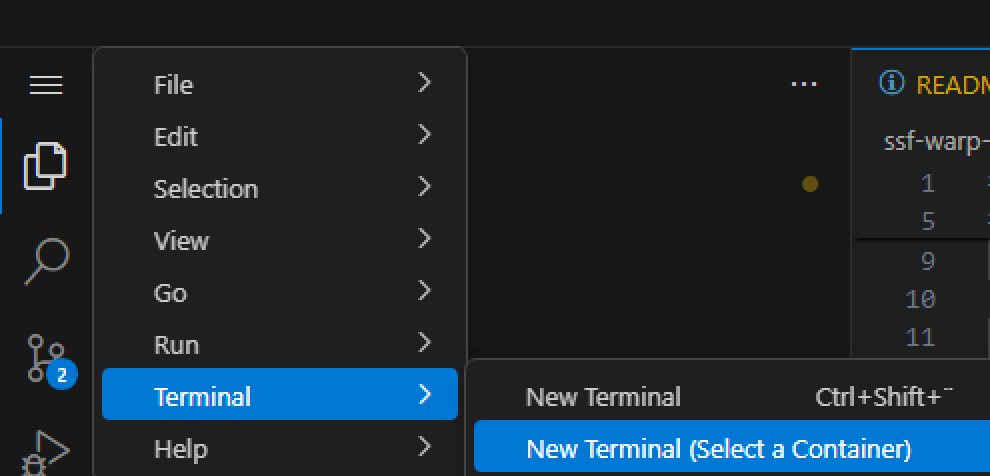
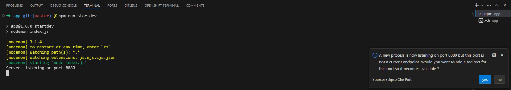
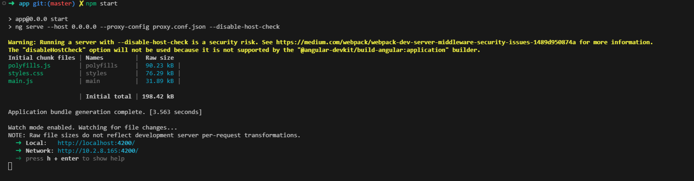

# NodeJs Express API with Angular Client (using Material Design)

This project demonstrates a simple REST API built with Express NodeJS and a corresponding Angular client application. It leverages Material Design for a user-friendly interface.

## Features

* **API:**
  * Provides endpoints, check the [openapi specification](./backend/app/openapi.yaml).
  * Uses prepared statements for secure database interaction (assuming PostgreSQL).
* **Angular Client:**
  * Fetches messages from the API and displays them in a list.
  * Allows adding new messages.
  * Implements ping functionality to check API health.
  * Utilizes Material Design components for a visually appealing interface.

## Launch the demo

### Setup database

  >
  > First time only
  >

* Open a new Terminal on the postgresql pod.

    
    

* In the terminal launch the following command to configure the database.

  >
  > Password is: `pass`
  >

  ```bash
    psql -d db -U user -W -f /projects/js/backend/db/schema.sql
  ```

  >
  > Output sample
  >

  ```bash
  sh-4.4$  psql -d db -U user -W -f /projects/js/backend/db/schema.sql
  Password: 
  CREATE TABLE
  sh-4.4$ 
  ```

* You can do the same with pgadmin which is running in your workspace, open a new terminal

  ```bash
  echo https://$(oc get route $DEVWORKSPACE_ID-pgadmin4-5050-web -o jsonpath='{ ..spec.host }')
  ```

  

### Live Coding of the NodeJs server

* Launch `npm install` to download all the necessary libs.

  ```bash
  cd backend/app

  npm install
  ```

* The nodejs backend use `nodemon` for live coding, so simply launch the command to start the application.

  ```bash
    cd backend/app
    npm run startdev
  ```

  

  >
  > Click Yes if you like to expose outside of the workspace.
  >

  

* Under the `backend/app` you have the [OpenApi specification](./backend/app/openapi.yaml) and you can try directly the endpoint.

  

  

### Live Coding of Frontend App

* Launch `npm install` to download all the necessary libs.

  ```bash
  cd frontend/app

  npm install
  ```

* Launch `npm start` to start the Live Coding.

  ```bash
  npm start
  ```

  

### Test the application

* From the endpoint section now you can access the frontend application.

  

* Click it and now you can acces the application.

  
